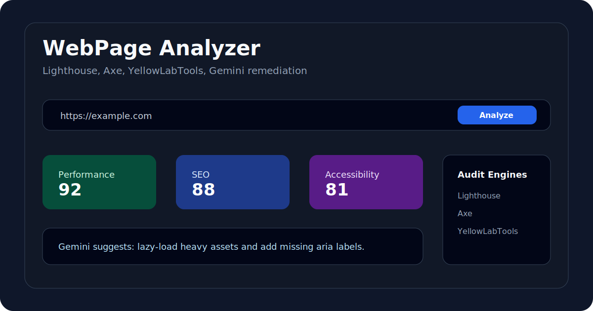

# WebPage Analyzer

Full-stack website audit dashboard with AI-assisted remediation notes.



WebPage Analyzer combines Lighthouse, Axe, YellowLabTools, and Gemini into one workflow: enter a URL, run technical audits, inspect the results, and generate practical fix suggestions.

## Product Flow

1. Enter a target website URL.
2. Backend runs audit engines and gathers metrics.
3. Frontend visualizes performance, SEO, accessibility, and technical findings.
4. Gemini generates targeted repair suggestions for selected issues.
5. The current report is stored locally so users can return to it.

## Highlights

- Performance, SEO, accessibility, and code-quality oriented website checks
- Lighthouse and Axe based audit pipeline
- YellowLabTools integration with bounded polling
- Gemini-powered fix suggestions for detected issues
- React dashboard with report persistence in local storage
- Configurable frontend API base URL through `VITE_API_BASE_URL`

## Architecture

| Area | Implementation |
| --- | --- |
| Frontend | React, Vite, Framer Motion, Recharts |
| Backend | Express API |
| Browser automation | Puppeteer, Chrome Launcher |
| Audit engines | Lighthouse, Axe, YellowLabTools |
| AI remediation | Gemini API |

## Environment

Backend `.env`:

```env
PORT=5000
GEMINI_API_KEY=your_gemini_api_key
```

Frontend `.env`:

```env
VITE_API_BASE_URL=http://localhost:5000
```

## Local Development

Backend:

```bash
cd backend
npm install
npm start
```

Frontend:

```bash
cd frontend
npm install
npm run dev
```

Open the Vite URL, usually `http://localhost:5173`.

## Validation

```bash
cd frontend
npm run lint
npm run build
```

```bash
cd backend
npm run check
```

## Recent Hardening

- Replaced hardcoded frontend API URLs with `VITE_API_BASE_URL`
- Added timeout protection to YellowLab polling
- Removed unused backend dependencies
- Fixed frontend dependency resolution so normal `npm install` works

## Roadmap

- Add saved report export
- Add per-audit loading states
- Split frontend chart/report components
- Add integration tests around analyzer endpoints

## Author

Onur Acar - <https://github.com/onuracar-dev>
