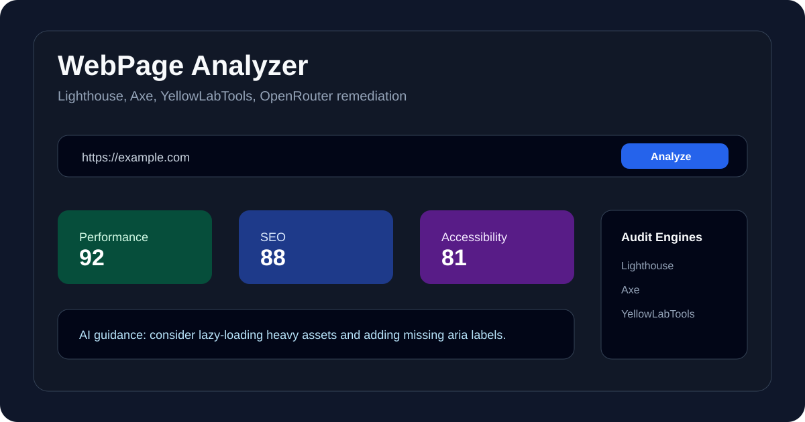

# WebPage Analyzer

Production-oriented website audit platform with AI-assisted remediation.



[Live website](https://webpage-analyzer.onuracar.dev/)

WebPage Analyzer combines Lighthouse, Axe, YellowLabTools, bounded discovery, and optional OpenRouter-backed remediation in one workflow. A user submits an authorized public target, the backend runs bounded audits through an SSRF-aware network boundary, and the React dashboard presents prioritized measured findings.

## What is included

- Lighthouse desktop/mobile audits for performance, SEO, accessibility, and best practices
- Axe accessibility findings and YellowLab frontend-quality signals
- Optional, provider-independent OpenRouter remediation suggestions and executive summaries
- PostgreSQL-backed projects, scans, versioned report history and credit ledger
- Executable per-engine capability/coverage status with honest partial reports
- Durable page-level retries, lease reclaim and reconnect-safe bounded progress
- Crawler route/referrer evidence, Visual UX viewport rectangles and versioned Source Audit results
- TR/EN JSON and server-rendered PDF export
- Separate customer and 2FA-protected administrator portals
- A real Free entitlement state plus Paddle checkout, signed webhook reconciliation, cancellation and buyer-portal access; Stripe remains an optional legacy adapter
- Resend-backed verification, password-reset and transactional notifications through an isolated email service
- Lazy-loaded report visualization to keep the initial frontend bundle smaller
- Docker deployment with an Nginx same-origin API proxy
- Automated syntax, lint, test, build, and dependency-audit checks

## Security model

Analyzing arbitrary URLs is inherently high-risk. This implementation applies several layers:

1. Only credential-free `http:` and `https:` URLs on configured ports are accepted.
2. Local names and private, loopback, link-local, multicast, documentation, and reserved IPv4/IPv6 ranges are rejected.
3. Every Chromium connection passes through a loopback-only proxy that resolves the destination again, rejects mixed public/private DNS answers, and connects to the vetted IP. Redirects and subresources therefore receive the same check.
4. Analysis concurrency, queue length, duration, proxy connections, and transferred bytes are bounded.
5. CORS uses an explicit origin list; request bodies are small and schema validated.
6. General, analysis, and AI routes have separate rate limits.
7. Browser mutations require a trusted origin, and workspace access comes from a Better Auth session rather than caller-supplied IDs.
8. Administrator authority is stored server-side, requires TOTP 2FA, and is never inferred from the UI. Separate admin API keys are reserved for automation.
9. Public-link modules can scan a credential-free public URL without ownership proof. Whole-site crawling, passive security, and journeys require the target's exact per-project DNS TXT challenge. Automated monitoring is not a launch capability.
10. Raw analyzer and source files use randomized names and are deleted after parsing by default.

The application-level proxy materially reduces SSRF risk, but production deployments must also enforce host/cloud outbound firewall policy. The API, analysis worker, AI service, email service, billing egress and database use separate Compose networks and secret sets. Block cloud metadata and all private/link-local ranges at the infrastructure layer; restrict provider egress as described in [`docs/PRODUCTION_DEPLOYMENT.md`](docs/PRODUCTION_DEPLOYMENT.md). The API image has no browser/OSV tools; hostile browser/source/PDF work belongs to the isolated worker described in [`docs/INFRA_RUNTIME_BOUNDARY.md`](docs/INFRA_RUNTIME_BOUNDARY.md). Do not set `CHROME_NO_SANDBOX=true`: the worker fails closed when the real sandbox is unavailable.

## Data flow and privacy

- The target URL is submitted to YellowLabTools when that analyzer is enabled.
- A minimized, redacted finding or aggregate score set is sent to OpenRouter only when a user explicitly requests an AI response. OpenRouter may route to the configured underlying model providers; full HTML, cookies, authorization headers, source archives and repository contents are not normal AI inputs.
- Account, project, credit, scan and report records are stored in PostgreSQL and isolated by workspace.
- Analyzer artifacts are temporary unless `KEEP_ANALYZER_ARTIFACTS=true` is explicitly configured.

Do not submit URLs containing sensitive query parameters or one-time tokens: the complete target URL must be sent to the audit providers and is retained in the submitting browser's local history.

Review the third-party terms and privacy requirements before operating a public service.

## Architecture

| Area | Implementation |
| --- | --- |
| Frontend | Unified React 19 + Vite marketing site, auth screens, customer portal and admin console |
| API | Express 5, Zod, Helmet, express-rate-limit |
| Identity and billing | Better Auth with verified email and TOTP; Paddle Checkout/signed webhooks behind a provider-neutral billing contract |
| Persistence and jobs | PostgreSQL plus pg-boss durable jobs |
| Audit engines | Lighthouse, Axe, YellowLabTools |
| Browser boundary | DNS/IP policy plus a per-analysis safe HTTP CONNECT proxy |
| AI | Internal AI service → configurable OpenRouter primary/fallback models; optional legacy adapter for development only |
| Email | Internal email service → Resend |
| Deployment | Ubuntu 24.04, Docker Compose, host TLS reverse proxy, non-root/read-only service containers |

## Local development

Requirements: Node.js 20.19+ (Node 24 is used in CI), npm, and Chrome/Chromium.

```bash
cp backend/environment.template backend/.env
cd backend
npm ci
npm start
```

In another terminal:

```bash
cd website
npm ci
npm run dev
```

Vite proxies `/api` to `http://localhost:5000`, so `VITE_API_BASE_URL` can stay empty. Open `http://localhost:5173`.

Local in-process development can use injected provider doubles. The production topology runs dedicated `ai-service` and `email-service` containers; configure them through the root `.env` contract and never put provider secrets in a `VITE_*` variable because Vite embeds those values in public browser assets.

## Configuration

All options and conservative defaults are documented in [`backend/environment.template`](./backend/environment.template). The most important settings are:

| Variable | Purpose |
| --- | --- |
| `CORS_ORIGINS` | Comma-separated exact frontend origins |
| `API_KEYS` | Optional comma-separated keys for analyze/AI endpoints |
| `ADMIN_API_KEYS` | Separate non-browser automation keys for protected admin operations |
| `BOOTSTRAP_ADMIN_EMAILS` | Exact existing account emails allowed to create the initial super-admin record |
| `BETTER_AUTH_SECRET` | At least 32 random characters used only by the backend |
| `BILLING_PROVIDER` / `PADDLE_*` | Production Paddle API/webhook credentials and fixed Signal/Studio price mappings |
| `AI_SERVICE_TOKEN` / `OPENROUTER_*` | Internal AI authentication plus server-side OpenRouter key, attribution and deployment-time model chain |
| `EMAIL_SERVICE_TOKEN` / `RESEND_API_KEY` / `EMAIL_FROM` | Internal email authentication and verified Resend sender |
| `MAX_CONCURRENT_ANALYSES` / `MAX_QUEUED_ANALYSES` | Bounded local work queue |
| `*_TIMEOUT_MS` | Overall and per-provider deadlines |
| `ALLOWED_TARGET_PORTS` | Public destination ports; keep `80,443` in production |
| `KEEP_ANALYZER_ARTIFACTS` | Retain raw audit JSON; defaults to `false` |
| `TRUST_PROXY` | Enable only behind a trusted reverse proxy |

Production rate-limit buckets and entitlement/usage ledgers are PostgreSQL-backed and namespace each endpoint budget. The in-memory implementation is development-only.

`API_KEYS` is intended for external API automation. The browser UI never embeds shared API or admin keys; it uses secure Better Auth session cookies and server-side workspace limits.

The unified site routes are `/` (marketing), `/login`, `/register`, `/app` (customer workspace) and `/admin`. To bootstrap the first administrator, register the exact email listed in `BOOTSTRAP_ADMIN_EMAILS`, enable TOTP from the protected admin gate, then sign in again. Remove the bootstrap email from deployment configuration after the admin row exists.

## API

Analyze a URL:

```bash
curl -X POST http://localhost:5000/api/analyze \
  -H "Content-Type: application/json" \
  -d '{"url":"https://example.com"}'
```

If `API_KEYS` is set, add `-H "X-API-Key: your-key"`. Administrative cleanup uses a key from `ADMIN_API_KEYS`:

```bash
curl -X DELETE http://localhost:5000/api/logs \
  -H "X-API-Key: your-admin-key"
```

Health endpoints are `GET /healthz` and `GET /readyz`. Error responses contain a stable `code` and `requestId` without stack traces or upstream error details.

## Docker deployment

The checked-in root `production.environment.template` is the production-safe baseline: role-scoped
PostgreSQL URLs require TLS. Copy it to `.env`, set separate
administrator/runtime/migrator/worker/maintenance/queue database passwords and
service/provider secrets (the resulting file is gitignored), provision the
private PostgreSQL CA/certificate files, and follow the exact commands in
[`docs/PRODUCTION_DEPLOYMENT.md`](docs/PRODUCTION_DEPLOYMENT.md). Production
uses both `docker-compose.yml` and `docker-compose.production.yml`; do not start
the base file alone and call it a production deployment.

For a disposable local stack using the bundled plaintext Postgres, make the
boundary explicit by using the local overlay and a separate env file. Do not
use this command for production:

```bash
copy production.environment.template .env.local
docker compose --env-file .env.local -f docker-compose.yml -f docker-compose.local.yml up --build -d
```

The `frontend/` directory is retained as a development/compatibility surface;
the canonical customer UI is `website/`. The release workflow publishes the
canonical `website` image only and does not publish the legacy frontend image.

The dashboard is served at `http://localhost:8080`; Nginx proxies `/api` to the private backend service. The one-shot `db-bootstrap`, `db-migrate`, and `db-grants` services create roles, apply checksummed migrations/pg-boss schema, and grant least-privilege access before API/worker startup. Set `PUBLIC_ORIGIN` to the exact HTTPS origin in production. Terminate TLS at a trusted load balancer or ingress and keep the backend port private.

## Verification

```bash
cd backend
npm ci
npm run check
npm run db:check
npm run lint
npm test
npm audit --audit-level=moderate

cd ../website
npm ci
npm run build
npm audit --audit-level=moderate
```

Most backend tests inject analyzer, DNS, and AI doubles and do not contact external services. Guarded suites use `TEST_DATABASE_URL` for PostgreSQL/pg-boss and `RUN_REAL_CHROME=1` for an installed-browser fixture; a skipped guarded suite is UNPROVEN, not PASS.

## Operational limitations

- Lighthouse and Chromium are resource-intensive. Start with one backend instance and low concurrency, then measure memory/CPU before increasing limits.
- Without PostgreSQL the development fallback queue and store are intentionally ephemeral; production requires PostgreSQL.
- Email verification/reset code is wired to Resend, but the real sender domain, SPF/DKIM and live delivery must be verified before launch.
- Public legal documents fail closed until the operator identity/address/effective date are supplied. Their jurisdiction-specific wording still requires operator/legal review before accepting live revenue.
- Paddle, OpenRouter, DNS/TLS, an external uptime monitor, and restore drills require real external configuration; repository tests do not prove those live systems.
- A successful automated scan is not a security, accessibility, legal, or compliance certification.

Security reports can be sent to the private contact channel listed on the live website.
